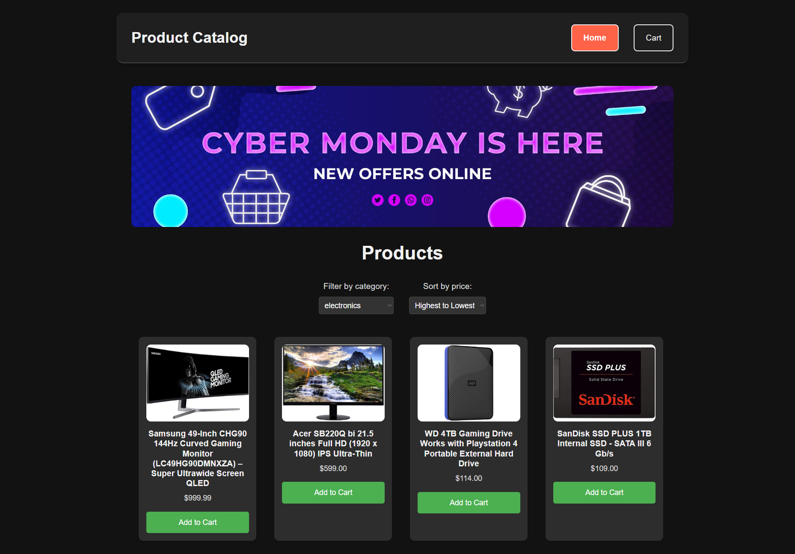
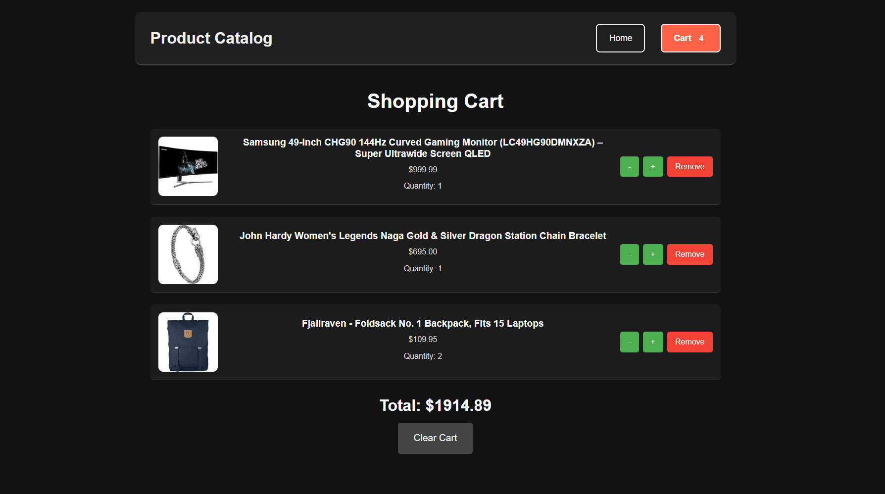
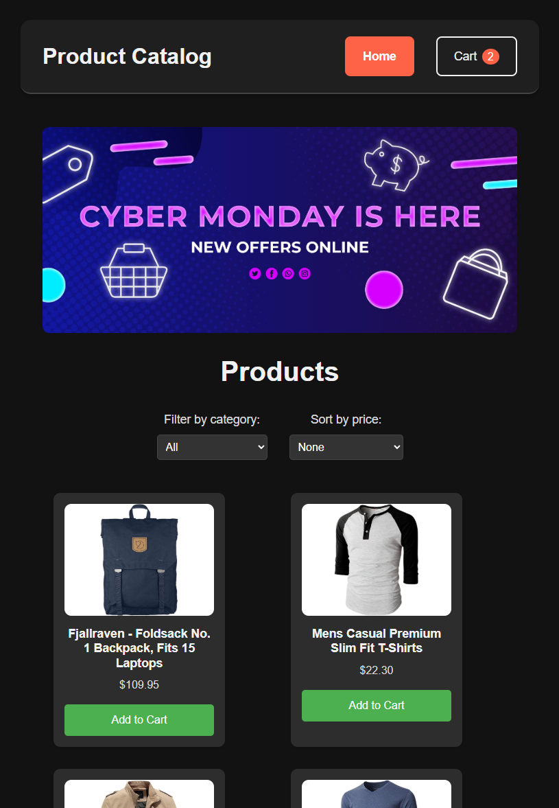

<div align="center">

# 🛒 ShopEase - Modern E-Commerce Product Catalog

A sleek, responsive product catalog application built with React, TypeScript, and modern web technologies. Features real-time cart management, dynamic filtering, and a polished dark-themed UI.

[](https://reactjs.org/)
[](https://www.typescriptlang.org/)
[](https://vitejs.dev/)
[](https://styled-components.com/)

[Features](#-features) · [Tech Stack](#-tech-stack) · [Getting Started](#-getting-started)

</div>

---

## 📸 Screenshots

<div align="center">

### 🏠 Home Page


---

### 🛒 Shopping Cart


---

### 📱 Mobile Responsive View


</div>

---

## ✨ Features

### Core Functionality
| Feature | Description |
|---------|-------------|
| 🏪 **Product Catalog** | Browse 20+ products with images, descriptions, and pricing |
| 🛒 **Shopping Cart** | Full cart management with add, remove, and quantity controls |
| 💰 **Real-time Pricing** | Automatic total calculation as cart updates |
| 🔍 **Category Filtering** | Filter products by categories (electronics, jewelry, clothing) |
| 📊 **Price Sorting** | Sort products by price (ascending/descending) |
| 🧹 **Clear Cart** | One-click cart reset functionality |

### Technical Highlights
| Implementation | Details |
|----------------|---------|
| 🎨 **Modern UI/UX** | Dark theme with smooth transitions and hover effects |
| 📱 **Fully Responsive** | Optimized layouts for desktop, tablet, and mobile |
| 🔄 **State Management** | React Context API for global cart state |
| 🌐 **API Integration** | Real-time data fetching from FakeStore API |
| ✅ **Type Safety** | Comprehensive TypeScript types for props and state |
| 🧪 **Unit Testing** | Component tests with React Testing Library & Vitest |

---

## 🛠 Tech Stack

<div align="center">

### Frontend


### Build & Development


### API


</div>

---

## 🏗 Architecture

```
src/
├── 📁 components/          # Reusable UI components
│   ├── Header.tsx          # Navigation with cart badge
│   ├── Footer.tsx          # Site footer
│   ├── ProductCard.tsx     # Product display card
│   └── CartItem.tsx        # Cart item with quantity controls
│
├── 📁 pages/               # Route components
│   ├── HomePage.tsx        # Product listing with filters
│   └── CartPage.tsx        # Shopping cart view
│
├── 📁 context/             # Global state management
│   └── CartContext.tsx     # Cart state with React Context
│
├── 📁 types/               # TypeScript definitions
│   ├── Product.ts          # Product interface
│   └── CartItemType.ts     # Cart item interface
│
├── 📁 styles/              # Global styling
│   └── GlobalStyle.ts      # Styled-components global styles
│
├── 📁 __tests__/           # Unit tests
│   └── *.test.tsx          # Component tests
│
└── App.tsx                 # Root component with routing
```

---

## 🚀 Getting Started

### Prerequisites
- **Node.js** 18.x or higher
- **npm** 9.x or higher

### Installation

```bash
# Clone the repository
git clone https://github.com/maximstav/react-test.git

# Navigate to project directory
cd react-test

# Install dependencies
npm install

# Start development server
npm run dev
```

The app will be running at `http://localhost:5173`

### Available Scripts

| Command | Description |
|---------|-------------|
| `npm run dev` | Start development server with hot reload |
| `npm run build` | Build production bundle |
| `npm run preview` | Preview production build locally |
| `npm run test` | Run unit tests |
| `npm run test:ui` | Run tests with interactive UI |

---

## 💡 Key Learning Outcomes

This project demonstrates proficiency in:

- **React Fundamentals** — Component composition, props, and lifecycle management
- **TypeScript Integration** — Type-safe development with interfaces and generics
- **State Management** — Context API for global state without external libraries
- **Modern CSS-in-JS** — Styled-components with dynamic theming and responsive design
- **API Consumption** — Async data fetching with proper loading and error states
- **Testing Best Practices** — Unit testing with React Testing Library
- **Build Tooling** — Modern development workflow with Vite

---

## 🔮 Future Enhancements

- [ ] User authentication and persistent cart
- [ ] Product search functionality
- [ ] Wishlist feature
- [ ] Checkout flow with payment integration
- [ ] Product reviews and ratings
- [ ] Admin dashboard for inventory management

---

## 📫 Contact

<div align="center">

**Maxim Staver**

[](mailto:stavermaxim9@gmail.com)
[](https://github.com/maximstav)
[](https://linkedin.com/in/YOUR_LINKEDIN)

</div>

---

<div align="center">

**⭐ If you found this project helpful, please consider giving it a star!**

Made with ❤️ and React

</div>
